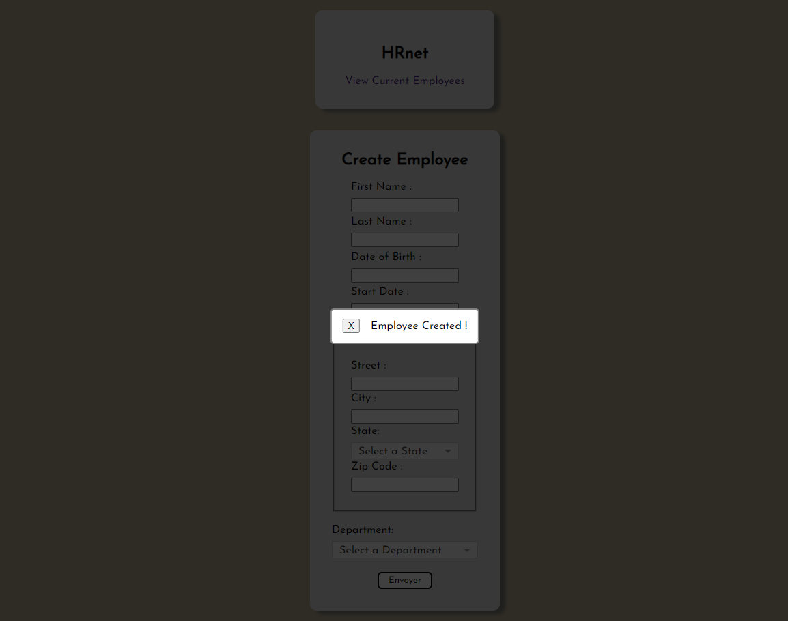

# Modal component

A simple and reusable Modal component for React.

This component allow you to render a modal with a message in the center of your screen.



# Installation

The package can be installed via npm :

```
npm i p14-modal-component-library
```

# Configuration

The component needs two props :

- {message} : write here the message you want to display in the modal.
- {onClose} : handler to close the modal.
  You will have to add a handle closing function in your file.

  Example :

### - JS

```js
const [isModalVisible, setIsModalVisible] = useState(false);

const handleSave = (e) => {
	e.preventDefault();
	setIsModalVisible(true);
};

const handleClosing = (e) => {
	setIsModalVisible(false);
};
```

### - JSX

```js
{
	isModalVisible && (
		<Modal message={"Employee Created !"} onClose={handleClosing} />
	);
}
```

# Compatibility

This component has been developped with the current latest version of React (v18.2.0).
